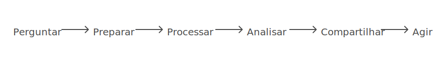

# Certificado Profissional de Google Data Analytics

Este repositório contém o **projeto final do curso** realizado durante o curso **Certificado Profissional de Google Data Analytics**, oferecido pela **Coursera**. O objetivo do curso foi aprimorar minhas habilidades em **análise de dados** e me preparar para aplicar essas competências em projetos reais.

## Sobre o Curso

O curso abrange os **seis passos essenciais** da análise de dados:

1. **Perguntar**: Definir as perguntas certas a serem respondidas com os dados.
2. **Preparar**: Organizar e limpar os dados para análise.
3. **Processar**: Manipular e transformar os dados para análise mais aprofundada.
4. **Analisar**: Aplicar métodos analíticos para extrair insights.
5. **Compartilhar**: Criar visualizações e apresentar os resultados de maneira clara.
6. **Agir**: Utilizar os insights para tomar decisões informadas.

Durante o curso, trabalhei com **SQL**, **R**, **Tableau** e **planilhas (Google Sheets/Excel)**, com ênfase na análise e visualização de dados, resolução de problemas e comunicação de resultados.

---

## 💡 Conclusão

Este repositório serve como uma demonstração das habilidades adquiridas durante o curso **Certificado Profissional de Google Data Analytics**. As ferramentas e técnicas que aprendi são cruciais para a análise de dados no mercado atual, e estou agora aplicando esses conhecimentos em projetos reais.

---
